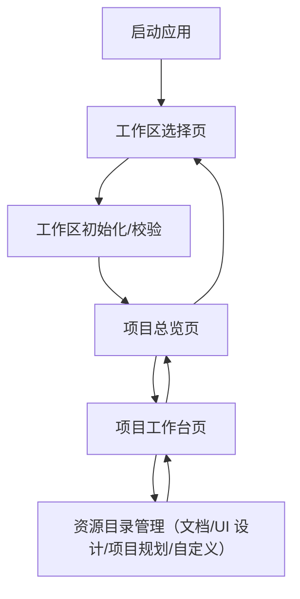

## 1. Product Overview

一款单机桌面应用：你先选择一个“工作区文件夹”，应用在其中管理多个本地项目，并提供主题等工作区级设置。
每个项目可绑定 Git 仓库并支持 clone/pull，同步后可一键用你指定的 IDE 打开。

## 2. Core Features

### 2.1 Feature Module

本应用由以下最小必要页面构成：

1. **工作区选择页**：选择/创建工作区、校验并初始化本地数据、进入应用。（**不再包含 settings 配置**，配置下沉到工作区内部或通过顶部菜单/托盘解决）
2. **项目总览页**：展示项目列表、创建空项目/导入本地项目（**移除 Clone from Git 入口**，Clone 统一在项目内的代码管理页进行）、项目搜索与排序。右侧预览面板仅展示项目描述与统计信息（**移除 Git Remote / Open in IDE**）。
3. **项目工作台页**：
    *   **侧边栏**：增加“项目介绍”页（作为默认首页），以及“代码”、“文档”、“UI 设计”、“项目规划”、“自定义”入口。
    *   **项目介绍页**：展示项目名称、描述（支持 Markdown 渲染）、修改按钮（点击进入编辑模式）；**展示统计看板：**
        *   **Code 概览**：仓库数量、最近活跃仓库（热度）、总提交数趋势（可选）。
        *   **Docs 概览**：文档数量、最近更新文档。
        *   **其他**：设计图数量等。
    *   **代码管理**：点击“代码”入口时，主内容展示该项目下的**多个代码仓库列表**；支持**创建新 Git 仓库**或**从 URL 克隆**；**Open in IDE 是针对单个代码仓库的操作**；支持**修改单个仓库配置**（别名/图标/默认 IDE/介绍）。
    *   **资源管理（Docs/UI 设计/规划）**：点击对应入口时，主内容展示类似**Windows 资源管理器**的文件浏览界面；支持**创建文件夹**；右侧展示预览（图片/文本）。**移除所有 Tab 设计**。

### 2.2 Page Details

| Page Name | Module Name  | Feature description                                                                     |
| --------- | ------------ | --------------------------------------------------------------------------------------- |
| 工作区选择页    | 工作区选择        | 选择本地文件夹作为工作区；支持创建空工作区文件夹；展示“最近工作区”列表并打开                                                 |
| 工作区选择页    | 工作区校验与初始化    | 检查并初始化工作区内应用数据目录/SQLite 数据库；校验目录可写、权限与路径有效性                                             |
| 工作区选择页    | 进入应用         | 校验通过后进入项目总览；支持从此页切换到另一个工作区                                                              |
| 项目总览页     | 项目列表         | 从工作区数据库读取并展示项目（名称、更新时间、路径、展示属性）；点击进入项目工作台                                             |
| 项目总览页     | 新建/导入项目      | 创建空项目（在工作区内生成项目目录+元数据）；支持导入已有项目目录                                                       |
| 项目总览页     | 预览面板         | 仅展示项目基础信息（名称、描述、路径、更新时间）；**移除 Git 信息与 Open in IDE 按钮**                                    |
| 项目总览页     | 搜索与排序        | 按项目名搜索；按更新时间/名称排序（本地计算）                                                                 |
| 项目总览页     | 全局外观入口       | 快速切换主题模式；修改后立即生效并写入工作区设置                                                                |
| 项目工作台页    | 侧边栏导航        | 增加“项目介绍”作为首项；统一展示“代码”、“文档”、“UI 设计”、“项目规划”、“自定义”入口；点击切换主内容区域。                            |
| 项目工作台页    | 项目介绍页        | 展示项目名称、描述（Markdown）；**统计看板**（代码仓库数/活跃度、文档数、设计图数）；提供“修改”按钮进入编辑模式。                      |
| 项目工作台页    | 代码仓库管理       | （选中“代码”时）展示**代码仓库列表**（无 Tab）；支持**新建/Clone 仓库**（弹窗表单：名称/别名/URL/图标/默认 IDE/介绍）；**每个仓库卡片提供 Open in IDE 与配置修改入口**。 |
| 项目工作台页    | 资源目录管理       | （选中其他类型时）展示**资源管理器样式**（无 Tab）；支持创建文件夹/文件操作；右侧展示预览。                                   |
| 项目工作台页    | 导航与切换        | 返回项目总览；支持切换工作区（回到选择页）                                                                   |

## 3. Core Process

**个人用户流程（无账号体系）**

1. 启动应用进入工作区选择页，选择/创建工作区。

2. 应用在工作区内初始化本地 SQLite 数据库与配置。

3. 进入项目总览页：

   * 你可以创建空项目或导入本地项目。

4. 进入项目工作台页后，默认展示“项目介绍页”，你可以在此查看或修改项目描述，并**概览代码活跃度与文档数量**。

5. **代码管理**：点击左侧“代码”，主内容区列出当前项目下的所有 Git 仓库。你可以**新建/Clone 仓库**（填写别名/默认 IDE/介绍等），也可以对已有仓库执行 Pull 或**用 IDE 打开**（针对单个仓库）。

6. **资源管理**：点击“文档”或“设计”，主内容区以**资源管理器**形式展示文件结构，右侧展示预览。

7. 对已绑定仓库的项目，应用会在后台定时检查 Git 状态并在 UI 标记（脏状态/远端更新/离线）。

8. 你在任意页面可用默认 IDE 或临时指定 IDE 打开项目（如 VS Code / JetBrains / Visual Studio 等）；你也可设置项目级 IDE 覆盖，然后返回总览继续管理或切换工作区。

