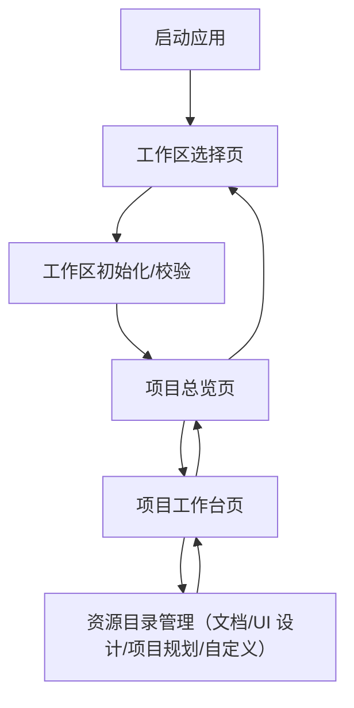

## 1. Product Overview

一款单机桌面应用：你先选择一个“工作区文件夹”，应用在其中管理多个本地项目，并提供主题等工作区级设置。
每个项目可绑定 Git 仓库并支持 clone/pull，同步后可一键用你指定的 IDE 打开。

## 2. Core Features

### 2.1 Feature Module

本应用由以下最小必要页面构成：

1. **工作区选择页**：选择/创建工作区、校验并初始化本地数据、配置工作区默认 IDE、配置主题并进入应用。
2. **项目总览页**：展示项目列表、从 Git 克隆项目/创建空项目、拉取更新（pull）、Git 仓库状态标记（是否有未提交变更/是否有远端更新）、项目搜索与排序、用指定的 IDE 打开项目。
3. **项目工作台页**：
    *   **侧边栏**：统一展示“代码”、“文档”、“UI 设计”、“项目规划”、“自定义”入口。
    *   **代码管理**：点击“代码”入口时，主内容展示该项目下的**多个代码仓库列表**；支持创建新 Git 仓库或从 URL 克隆；不展示具体代码文件内容，仅提供仓库级的操作（状态、IDE 打开、Pull）。
    *   **资源管理**：点击“文档/UI 设计/规划”等入口时，主内容展示对应的文件管理与预览（图片/文本）。

### 2.2 Page Details

| Page Name | Module Name  | Feature description                                                                     |
| --------- | ------------ | --------------------------------------------------------------------------------------- |
| 工作区选择页    | 工作区选择        | 选择本地文件夹作为工作区；支持创建空工作区文件夹；展示“最近工作区”列表并打开                                                 |
| 工作区选择页    | 工作区校验与初始化    | 检查并初始化工作区内应用数据目录/SQLite 数据库；校验目录可写、权限与路径有效性                                             |
| 工作区选择页    | 工作区默认 IDE    | 配置默认 IDE（如 VS Code / JetBrains / Visual Studio 等）；支持指定可执行文件路径与启动参数；保存到工作区设置             |
| 工作区选择页    | 外观与主题        | 选择主题模式（浅色/深色/跟随系统/自定义）；将设置持久化到当前工作区并在进入后自动加载                                            |
| 工作区选择页    | 进入应用         | 校验通过后进入项目总览；支持从此页切换到另一个工作区                                                              |
| 项目总览页     | 项目列表         | 从工作区数据库读取并展示项目（名称、更新时间、路径、绑定仓库信息、上次同步时间、展示属性）；点击进入项目工作台                                 |
| 项目总览页     | 新建/导入项目      | 创建空项目（在工作区内生成项目目录+元数据）；或从 Git 克隆项目（输入仓库 URL、分支/默认分支、目标目录名）                              |
| 项目总览页     | Git 状态标记与检查  | 对已绑定 Git 仓库的项目定时检查并展示：工作区是否脏（未提交变更）、是否存在远端可更新（落后于远端）以及上次检查时间；离线/失败时展示原因并允许手动重试；不自动 pull |
| 项目总览页     | 打开方式         | 用工作区默认 IDE 或临时指定 IDE 打开项目；支持在列表项上直接触发                                                   |
| 项目总览页     | 搜索与排序        | 按项目名搜索；按更新时间/名称排序（本地计算）                                                                 |
| 项目总览页     | 全局外观入口       | 快速切换主题模式；修改后立即生效并写入工作区设置                                                                |
| 项目工作台页    | 侧边栏导航        | 统一展示“代码”、“文档”、“UI 设计”、“项目规划”、“自定义”入口；点击切换主内容区域。                                      |
| 项目工作台页    | 代码仓库管理       | （选中“代码”时）展示项目关联的**多个代码仓库**列表；支持添加现有仓库、新建 Git 仓库、Clone 仓库；展示每个仓库的状态与 IDE 打开入口。             |
| 项目工作台页    | 资源目录管理       | （选中其他类型时）管理并列于项目根目录的资源文件；支持绑定/创建目录、文件浏览与基础预览（图片/文本）。                                   |
| 项目工作台页    | 导航与切换        | 返回项目总览；支持切换工作区（回到选择页）                                                                   |

## 3. Core Process

**个人用户流程（无账号体系）**

1. 启动应用进入工作区选择页，选择/创建工作区。

2. 应用在工作区内初始化本地 SQLite 数据库与配置；你设置工作区主题与默认 IDE（可选）。

3. 进入项目总览页：

   * 你可以创建空项目；或输入 Git 仓库 URL 进行 clone，把代码拉到工作区内。

4. 进入项目工作台页后，左侧导航栏列出“代码”、“文档”、“UI 设计”、“项目规划”等入口。

5. **代码管理**：点击“代码”，主内容区列出当前项目下的所有 Git 仓库。你可以继续 Clone 新仓库或创建本地仓库，也可以对已有仓库执行 Pull 或用 IDE 打开。

6. **资源管理**：点击“文档”或“设计”，主内容区展示对应的文件列表与预览。

7. 对已绑定仓库的项目，应用会在后台定时检查 Git 状态并在 UI 标记（脏状态/远端更新/离线）。

8. 你在任意页面可用默认 IDE 或临时指定 IDE 打开项目（如 VS Code / JetBrains / Visual Studio 等）；你也可设置项目级 IDE 覆盖，然后返回总览继续管理或切换工作区。

