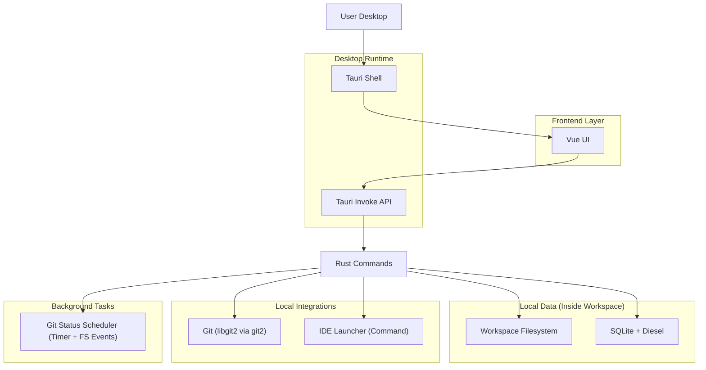
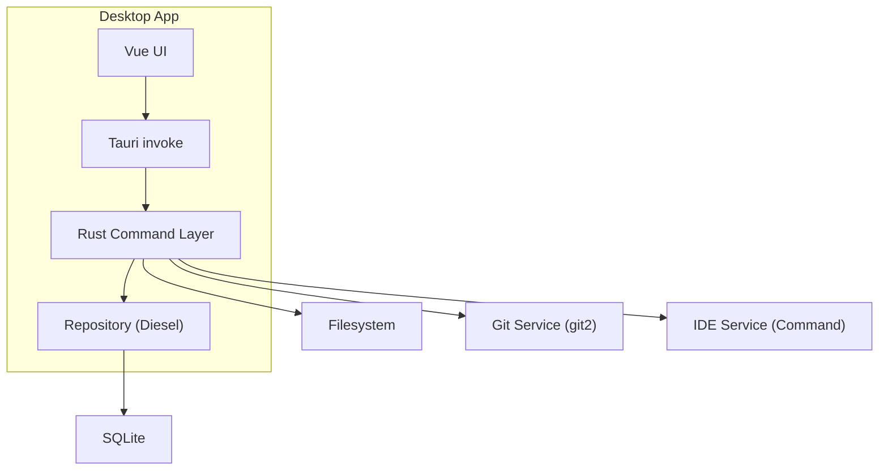
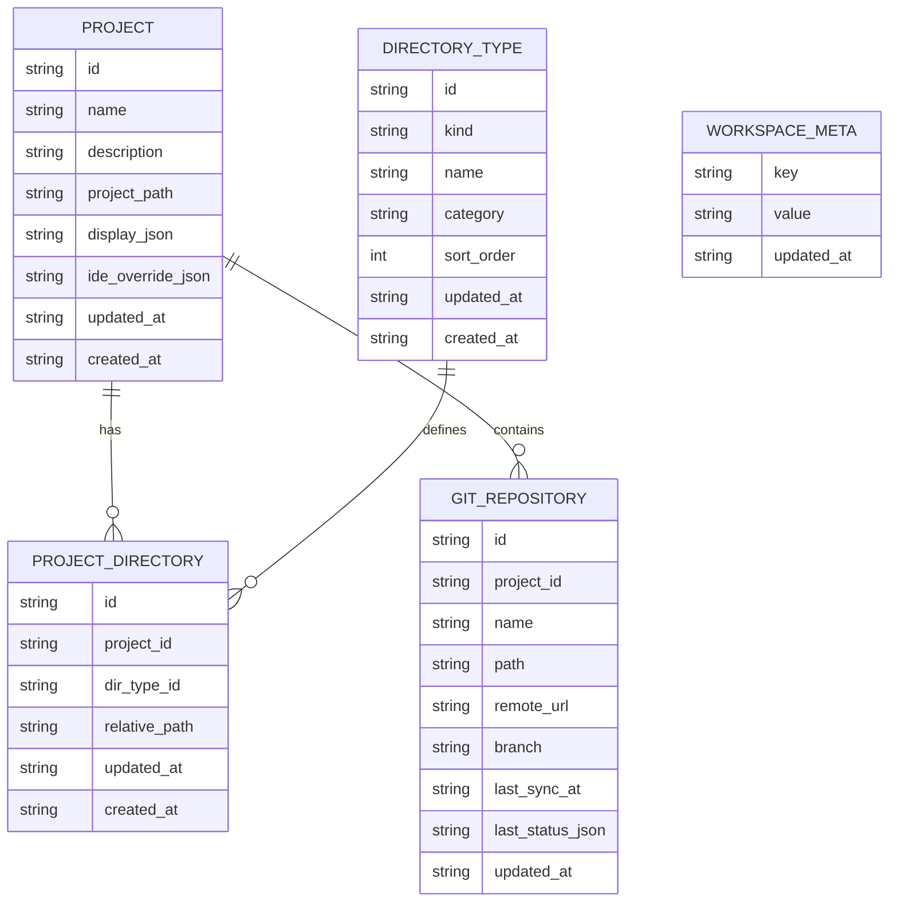

## 1.Architecture design



## 2.Technology Description

- Frontend: Vue@3 + TypeScript + Vite + Reka UI
- Desktop: Tauri (Rust) + WebView
- Backend: Rust (Tauri commands，仅本地能力)
- Data Layer: SQLite + Diesel（数据库文件放在你选择的工作区目录内）
- Git: git2（基于 libgit2，本地 clone/pull/状态读取）
- Background: Rust 定时任务 + 文件系统事件监听（用于 Git 脏状态快速刷新；远端更新采用轮询检查）

## 3.Route definitions

| Route         | Purpose                                                                           |
| ------------- | --------------------------------------------------------------------------------- |
| /workspace    | 工作区选择与初始化；配置主题与默认 IDE                                            |
| /projects     | 项目总览；项目列表/创建空项目/从 Git 克隆/pull/打开 IDE                           |
| /projects/:id | 项目工作台；项目详情、Git 状态与 pull、资源目录文件浏览与基础预览、IDE 设置与打开 |

## 4.API definitions (If it includes backend services)

以下为前端通过 `invoke` 调用的核心命令（等价于本地 API）。

### 4.1 Shared Types (TypeScript)

```ts
export type ThemeMode = 'light' | 'dark' | 'system' | 'custom';

export type SupportedIdeKind = 'vscode' | 'visual_studio' | 'jetbrains' | 'custom';

export type IdeConfig = {
  kind: SupportedIdeKind;
  /** 显示名，如：VS Code / Visual Studio 2022 / IntelliJ IDEA */
  name: string;
  /** 可执行文件绝对路径（Windows），或可解析的命令名 */
  exePath: string;
  /** 启动参数模板（可选），例如：["--reuse-window"] */
  args?: string[];
};

export type WorkspaceSettings = {
  themeMode: ThemeMode;
  customThemeId?: string;
  /** 工作区默认 IDE（用于“一键打开项目”） */
  defaultIde?: IdeConfig;
};

export type WorkspaceInfo = {
  path: string;
  dbPath: string;
  lastOpenedAt: string; // ISO time
  settings?: WorkspaceSettings;
};

export type ProjectDisplay = {
  themeMode?: Exclude<ThemeMode, 'system'>;
  themeColor?: string; // e.g. #4F46E5
};

/** 一个项目可关联多个 Git 仓库 */
export type GitRepository = {
  id: string; // UUID
  projectId: string;
  /** 仓库名称（通常为目录名） */
  name: string;
  /** 仓库绝对路径或相对路径 */
  path: string;
  remoteUrl?: string;
  branch?: string;
  lastSyncAt?: string; // ISO time
  lastStatusCheckedAt?: string; // ISO time
};

export type NetworkState = 'online' | 'offline' | 'unknown';

/**
 * Git 仓库状态（用于 UI 标记）：
 * - dirty：工作区/暂存区是否存在未提交变更
 * - ahead/behind：相对远端跟踪分支的提交差异（用于“有远端更新”提示）
 */
export type GitRepoStatus = {
  repoId: string; // 关联 GitRepository.id
  branch?: string;
  dirty: boolean;
  ahead: number;
  behind: number;
  lastCheckedAt: string; // ISO time
  network: NetworkState;
  lastError?: string;
};

export type Project = {
  id: string; // UUID
  name: string;
  description?: string;
  projectPath: string; // 工作区内的项目目录
  display?: ProjectDisplay;
  /** 项目级 IDE 覆盖；为空则继承 workspace.defaultIde */
  ideOverride?: IdeConfig;
  updatedAt: string; // ISO time
};

export type FileNode = {
  path: string;
  name: string;
  kind: 'file' | 'dir';
  children?: FileNode[];
};

export type GitCloneInput = {
  remoteUrl: string;
  /** 目标目录名（相对项目根目录） */
  targetDirName: string;
  branch?: string;
};

export type GitPullResult = {
  ok: boolean;
  message?: string;
  syncedAt?: string; // ISO time
};

/** 目录类型：用于项目内“资源目录”的分类（不包含代码目录浏览） */
export type DirectoryTypeKind =
  | 'code' // 代码入口
  | 'docs'
  | 'ui_design'
  | 'project_planning'
  | 'custom';

export type DirectoryType = {
  id: string; // UUID
  kind: DirectoryTypeKind;
  /** kind=custom 时必填；用于展示 */
  name: string;
  /** 可选：用于列表分组，如："文档"/"设计"/"规划" */
  category?: string;
  /** 列表排序，数值越小越靠前 */
  sortOrder: number;
  createdAt: string; // ISO time
  updatedAt: string; // ISO time
};

/** 项目绑定的具体目录（相对项目根目录/绝对路径由产品策略决定） */
export type ProjectDirectory = {
  id: string; // UUID
  projectId: string;
  dirTypeId: string;
  /** 目录路径：建议存相对项目根目录的相对路径，便于移动项目 */
  relativePath: string;
  createdAt: string; // ISO time
  updatedAt: string; // ISO time
};

export type PreviewKind = 'image' | 'markdown' | 'text';
```

### 4.2 Core Commands (invoke)

- `workspace_init_or_open(path: string) -> WorkspaceInfo`
- `workspace_list_recent() -> WorkspaceInfo[]`
- `workspace_settings_get() -> WorkspaceSettings`
- `workspace_settings_update(patch: Partial<WorkspaceSettings>) -> WorkspaceSettings`

- `projects_list() -> Project[]`
- `project_create(input: { name: string; description?: string; display?: ProjectDisplay }) -> Project`
- `project_get(id: string) -> Project`
- `project_update(id: string, patch: Partial<Pick<Project, "name" | "description" | "display" | "ideOverride">>) -> Project`
- `project_delete(id: string) -> { ok: boolean }`

- `git_repo_list(projectId: string) -> GitRepository[]`
- `git_repo_create(projectId: string, name: string) -> GitRepository`
- `git_repo_clone(projectId: string, input: GitCloneInput) -> GitRepository`
- `git_repo_pull(repoId: string) -> GitPullResult`

- `git_repo_status_get(repoId: string) -> GitRepoStatus`（读取本地状态：dirty/ahead/behind；不做网络请求）
- `git_repo_status_check(repoId: string) -> GitRepoStatus`（允许网络：用于检查远端更新；离线/失败返回 lastError + network）
- `git_status_watch_start(repoId?: string) -> { ok: boolean }`（开始后台监听：Timer + FS Events；repoId 为空表示监听全部 Git 仓库）
- `git_status_watch_stop(repoId?: string) -> { ok: boolean }`
- 事件：`tauri://git_status_changed`（payload: GitRepoStatus；用于 UI 实时更新徽标）

- `project_fs_tree(id: string, relativeRoot: string) -> FileNode`（仅用于已绑定的资源目录：relativeRoot 为资源目录相对路径）
- `fs_read_text(path: string) -> { content: string }`

- `dir_types_list() -> DirectoryType[]`（返回内置类型 + 自定义类型）
- `dir_type_create_custom(input: { name: string; category?: string; sortOrder?: number }) -> DirectoryType`
- `dir_type_update(id: string, patch: Partial<Pick<DirectoryType, "name" | "category" | "sortOrder">>) -> DirectoryType`

- `project_dirs_list(projectId: string) -> ProjectDirectory[]`
- `project_dir_create_or_update(projectId: string, input: { dirTypeId: string; relativePath: string }) -> ProjectDirectory`

- `preview_detect(path: string) -> { kind: PreviewKind }`（仅做类型判断；渲染由前端完成；复杂类型统一返回 text）

- `ide_list_supported() -> IdeConfig[]`（返回已内置/探测到的主流 IDE 入口，如 VS Code / JetBrains / Visual Studio 等）
- `ide_open_repo(repoId: string, ide?: IdeConfig) -> { ok: boolean; message?: string }`

## 5.Server architecture diagram (If it includes backend services)



## 6.Data model(if applicable)

### 6.1 Data model definition



### 6.2 Data Definition Language

数据库文件建议为：`{workspace}/.app/app.db`（示例；要求：必须位于工作区内）。

```sql
CREATE TABLE IF NOT EXISTS workspace_meta (
  key TEXT PRIMARY KEY,
  value TEXT NOT NULL,
  updated_at TEXT NOT NULL
);

-- workspace_meta 建议键（JSON 字符串）：
-- key='settings' value='{"themeMode":"system","customThemeId":null,"defaultIde":{...}}'

CREATE TABLE IF NOT EXISTS projects (
  id TEXT PRIMARY KEY,
  name TEXT NOT NULL,
  description TEXT,
  project_path TEXT NOT NULL,
  display_json TEXT,

  ide_override_json TEXT,

  created_at TEXT NOT NULL,
  updated_at TEXT NOT NULL
);

CREATE TABLE IF NOT EXISTS git_repositories (
  id TEXT PRIMARY KEY,
  project_id TEXT NOT NULL,
  name TEXT NOT NULL,
  path TEXT NOT NULL,
  remote_url TEXT,
  branch TEXT,
  last_sync_at TEXT,

  -- Git 状态缓存
  last_status_checked_at TEXT,
  last_status_json TEXT,

  created_at TEXT NOT NULL,
  updated_at TEXT NOT NULL
);

-- 目录类型：包含内置类型与自定义类型（无物理外键，按逻辑关联）
CREATE TABLE IF NOT EXISTS directory_types (
  id TEXT PRIMARY KEY,
  kind TEXT NOT NULL, -- code/docs/ui_design/project_planning/custom
  name TEXT NOT NULL,
  category TEXT,
  sort_order INTEGER NOT NULL DEFAULT 0,
  created_at TEXT NOT NULL,
  updated_at TEXT NOT NULL
);

-- 项目绑定的多类型目录（并列于代码目录的资源目录）
CREATE TABLE IF NOT EXISTS project_directories (
  id TEXT PRIMARY KEY,
  project_id TEXT NOT NULL,
  dir_type_id TEXT NOT NULL,
  relative_path TEXT NOT NULL,
  created_at TEXT NOT NULL,
  updated_at TEXT NOT NULL,
  UNIQUE(project_id, dir_type_id)
);

CREATE INDEX IF NOT EXISTS idx_projects_updated_at ON projects(updated_at DESC);
CREATE INDEX IF NOT EXISTS idx_projects_name ON projects(name);
CREATE INDEX IF NOT EXISTS idx_git_repositories_project_id ON git_repositories(project_id);

CREATE INDEX IF NOT EXISTS idx_directory_types_sort_order ON directory_types(sort_order);
CREATE INDEX IF NOT EXISTS idx_project_directories_project_id ON project_directories(project_id);
```
